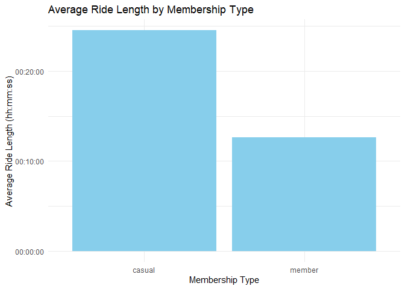
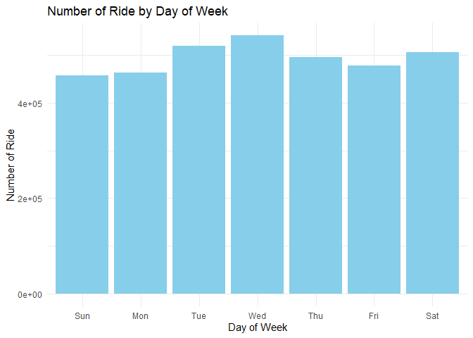
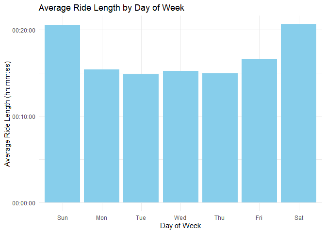
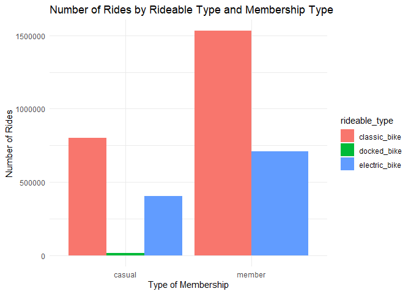

# Capstone Project of GCC Data Analysis (Cyclistic Bike Share)

## Skenario

Anda adalah seorang analis data junior yang bekerja di tim analis
pemasaran di Cyclistic, sebuah perusahaan berbagi sepeda di Chicago.
Direktur pemasaran percaya bahwa kesuksesan perusahaan di masa depan
tergantung pada upaya untuk memaksimalkan jumlah keanggotaan tahunan.
Oleh karena itu, tim Anda ingin memahami bagaimana pengendara kasual dan
anggota tahunan menggunakan sepeda Cyclistic secara berbeda. Dari
wawasan ini, tim Anda akan merancang strategi pemasaran baru untuk
mengubah pengendara biasa menjadi anggota tahunan. Tetapi pertama-tama,
para eksekutif Cyclistic harus menyetujui rekomendasi Anda, sehingga
rekomendasi tersebut harus didukung dengan wawasan data yang menarik dan
visualisasi data profesional.

## Panduan Pertanyaan

1.  Bagaimana anggota tahunan dan pengendara biasa menggunakan sepeda
    secara berbeda?
2.  Mengapa pengendara biasa membeli keanggotaan tahunan Cyclistic?
3.  Bagaimana Cyclistic menggunakan media digital untuk mempengaruhi
    pengendara biasa untuk menjadi anggota?

## Cakupan Laporan

1.  Pernyataan yang jelas tentang tugas bisnis
2.  Deskripsi dari semua sumber data yang digunakan
3.  Dokumentasi tahap pembersihan atau manipulasi data
4.  Ringkasan analisis
5.  Mendukung visualisasi dan temuan utama
6.  Tiga rekomendasi teratas berdasarkan analisis

## Tahapan

1.  Persiapan
2.  Pemrosesan Data
3.  Analisis

# Persiapan

## Pengumpulan Data

Data set disediakan oleh Motivate International Inc dan dapat diunduh
melalui tautan [ini](https://divvy-tripdata.s3.amazonaws.com/index.html)

## Integritas Data

Pemeriksaan standar ROCCC:

1.  *Reliable* : Data cukup besar untuk menganalisa perilaku pengguna di
    Cyclistic
2.  *Original*: Data asli disediakan oleh Motivate International Inc
3.  *Comprehensive*: Data memuat berbagai informasi yang diperlukan
4.  *Current*: Data merupakan data terkini beserta historisnya
5.  *Cited*: Informasi terkait data termasuk dengan lisensi tersedia
    dengan jelas

## Persiapan Package

Paket R yang akan digunakan adalah `tidyverse`

``` r
library(tidyverse)
```

## Mengimpor Data

``` r
csv_files <- list.files('data', full.names = T)

data <- sapply(csv_files, read_csv, simplify = F)
data <- do.call(rbind, data)
```

# Pemrosesan Data

## Pemeriksaan Kualitas Data

### Struktrur Data

#### Dimensi

``` r
dim(data)
```

    ## [1] 4686804      13

#### Nama kolom

``` r
names(data)
```

    ##  [1] "ride_id"            "rideable_type"      "started_at"        
    ##  [4] "ended_at"           "start_station_name" "start_station_id"  
    ##  [7] "end_station_name"   "end_station_id"     "start_lat"         
    ## [10] "start_lng"          "end_lat"            "end_lng"           
    ## [13] "member_casual"

#### Struktur data frame

``` r
glimpse(data)
```

    ## Rows: 4,686,804
    ## Columns: 13
    ## $ ride_id            <chr> "903C30C2D810A53B", "F2FB18A98E110A2B", "D0DEC7C94E…
    ## $ rideable_type      <chr> "electric_bike", "electric_bike", "electric_bike", …
    ## $ started_at         <dttm> 2023-08-19 15:41:53, 2023-08-18 15:30:18, 2023-08-…
    ## $ ended_at           <dttm> 2023-08-19 15:53:36, 2023-08-18 15:45:25, 2023-08-…
    ## $ start_station_name <chr> "LaSalle St & Illinois St", "Clark St & Randolph St…
    ## $ start_station_id   <chr> "13430", "TA1305000030", "TA1305000030", "KA1504000…
    ## $ end_station_name   <chr> "Clark St & Elm St", NA, NA, NA, NA, NA, NA, NA, NA…
    ## $ end_station_id     <chr> "TA1307000039", NA, NA, NA, NA, NA, NA, NA, NA, NA,…
    ## $ start_lat          <dbl> 41.89072, 41.88451, 41.88498, 41.90310, 41.88555, 4…
    ## $ start_lng          <dbl> -87.63148, -87.63155, -87.63079, -87.63467, -87.632…
    ## $ end_lat            <dbl> 41.90297, 41.93000, 41.91000, 41.90000, 41.89000, 4…
    ## $ end_lng            <dbl> -87.63128, -87.64000, -87.63000, -87.62000, -87.680…
    ## $ member_casual      <chr> "member", "member", "member", "member", "member", "…

``` r
str(data)
```

    ## spc_tbl_ [4,686,804 × 13] (S3: spec_tbl_df/tbl_df/tbl/data.frame)
    ##  $ ride_id           : chr [1:4686804] "903C30C2D810A53B" "F2FB18A98E110A2B" "D0DEC7C94E4663DA" "E0DDDC5F84747ED9" ...
    ##  $ rideable_type     : chr [1:4686804] "electric_bike" "electric_bike" "electric_bike" "electric_bike" ...
    ##  $ started_at        : POSIXct[1:4686804], format: "2023-08-19 15:41:53" "2023-08-18 15:30:18" ...
    ##  $ ended_at          : POSIXct[1:4686804], format: "2023-08-19 15:53:36" "2023-08-18 15:45:25" ...
    ##  $ start_station_name: chr [1:4686804] "LaSalle St & Illinois St" "Clark St & Randolph St" "Clark St & Randolph St" "Wells St & Elm St" ...
    ##  $ start_station_id  : chr [1:4686804] "13430" "TA1305000030" "TA1305000030" "KA1504000135" ...
    ##  $ end_station_name  : chr [1:4686804] "Clark St & Elm St" NA NA NA ...
    ##  $ end_station_id    : chr [1:4686804] "TA1307000039" NA NA NA ...
    ##  $ start_lat         : num [1:4686804] 41.9 41.9 41.9 41.9 41.9 ...
    ##  $ start_lng         : num [1:4686804] -87.6 -87.6 -87.6 -87.6 -87.6 ...
    ##  $ end_lat           : num [1:4686804] 41.9 41.9 41.9 41.9 41.9 ...
    ##  $ end_lng           : num [1:4686804] -87.6 -87.6 -87.6 -87.6 -87.7 ...
    ##  $ member_casual     : chr [1:4686804] "member" "member" "member" "member" ...
    ##  - attr(*, "spec")=
    ##   .. cols(
    ##   ..   ride_id = col_character(),
    ##   ..   rideable_type = col_character(),
    ##   ..   started_at = col_datetime(format = ""),
    ##   ..   ended_at = col_datetime(format = ""),
    ##   ..   start_station_name = col_character(),
    ##   ..   start_station_id = col_character(),
    ##   ..   end_station_name = col_character(),
    ##   ..   end_station_id = col_character(),
    ##   ..   start_lat = col_double(),
    ##   ..   start_lng = col_double(),
    ##   ..   end_lat = col_double(),
    ##   ..   end_lng = col_double(),
    ##   ..   member_casual = col_character()
    ##   .. )
    ##  - attr(*, "problems")=<externalptr>

## Data Cleansing

### Check dan hapus NA (missing values)

``` r
na_data <- is.na(data)
sum(na_data)
```

    ## [1] 3243128

Total missing: 3243128

``` r
clean_data <- na.omit(data)
sum(is.na(clean_data))
```

    ## [1] 0

``` r
glimpse(clean_data)
```

    ## Rows: 3,459,888
    ## Columns: 13
    ## $ ride_id            <chr> "903C30C2D810A53B", "6400344C80D626CA", "B56F0D2EC8…
    ## $ rideable_type      <chr> "electric_bike", "electric_bike", "electric_bike", …
    ## $ started_at         <dttm> 2023-08-19 15:41:53, 2023-08-11 14:27:09, 2023-08-…
    ## $ ended_at           <dttm> 2023-08-19 15:53:36, 2023-08-11 14:34:46, 2023-08-…
    ## $ start_station_name <chr> "LaSalle St & Illinois St", "Clark St & Randolph St…
    ## $ start_station_id   <chr> "13430", "TA1305000030", "13154", "TA1305000022", "…
    ## $ end_station_name   <chr> "Clark St & Elm St", "Dearborn Pkwy & Delaware Pl",…
    ## $ end_station_id     <chr> "TA1307000039", "TA1307000128", "KA1504000096", "TA…
    ## $ start_lat          <dbl> 41.89072, 41.88497, 41.91070, 41.88837, 41.88775, 4…
    ## $ start_lng          <dbl> -87.63148, -87.63144, -87.65320, -87.63732, -87.636…
    ## $ end_lat            <dbl> 41.90297, 41.89897, 41.95359, 41.89897, 41.89897, 4…
    ## $ end_lng            <dbl> -87.63128, -87.62991, -87.70931, -87.62991, -87.629…
    ## $ member_casual      <chr> "member", "member", "member", "member", "member", "…

Total data clean: 3459888

### Pemeriksaan Duplikat

Dilakukan terhadap kolom `ride_id`

``` r
is_duplicated <- duplicated(clean_data$ride_id)
sum(is_duplicated)
```

    ## [1] 121

Ada sebanyak 121 baris duplikat. Selanjutnya hapus baris yang duplikat.

``` r
clean_data <- clean_data[!is_duplicated,]
nrow(clean_data)
```

    ## [1] 3459767

Data bersih tersisa 3459767 baris. Data ini yang akan digunakan untuk
analisis. Kita lihat summary dari data:

``` r
summary(clean_data)
```

    ##    ride_id          rideable_type        started_at                    
    ##  Length:3459767     Length:3459767     Min.   :2023-08-01 00:00:07.00  
    ##  Class :character   Class :character   1st Qu.:2023-10-21 00:19:24.00  
    ##  Mode  :character   Mode  :character   Median :2024-04-08 14:30:44.00  
    ##                                        Mean   :2024-02-26 10:01:45.13  
    ##                                        3rd Qu.:2024-06-12 07:59:03.52  
    ##                                        Max.   :2024-07-31 23:54:26.53  
    ##     ended_at                      start_station_name start_station_id  
    ##  Min.   :2023-08-01 00:01:03.00   Length:3459767     Length:3459767    
    ##  1st Qu.:2023-10-21 00:33:31.00   Class :character   Class :character  
    ##  Median :2024-04-08 14:51:11.00   Mode  :character   Mode  :character  
    ##  Mean   :2024-02-26 10:18:34.36                                        
    ##  3rd Qu.:2024-06-12 08:11:32.50                                        
    ##  Max.   :2024-07-31 23:59:56.74                                        
    ##  end_station_name   end_station_id       start_lat       start_lng     
    ##  Length:3459767     Length:3459767     Min.   :41.65   Min.   :-87.84  
    ##  Class :character   Class :character   1st Qu.:41.88   1st Qu.:-87.66  
    ##  Mode  :character   Mode  :character   Median :41.89   Median :-87.64  
    ##                                        Mean   :41.90   Mean   :-87.64  
    ##                                        3rd Qu.:41.93   3rd Qu.:-87.63  
    ##                                        Max.   :42.06   Max.   :-87.53  
    ##     end_lat         end_lng       member_casual     
    ##  Min.   : 0.00   Min.   :-87.84   Length:3459767    
    ##  1st Qu.:41.88   1st Qu.:-87.66   Class :character  
    ##  Median :41.90   Median :-87.64   Mode  :character  
    ##  Mean   :41.90   Mean   :-87.64                     
    ##  3rd Qu.:41.93   3rd Qu.:-87.63                     
    ##  Max.   :42.06   Max.   :  0.00

``` r
str(clean_data)
```

    ## tibble [3,459,767 × 13] (S3: tbl_df/tbl/data.frame)
    ##  $ ride_id           : chr [1:3459767] "903C30C2D810A53B" "6400344C80D626CA" "B56F0D2EC8B33085" "EE2EF7362A4CE72A" ...
    ##  $ rideable_type     : chr [1:3459767] "electric_bike" "electric_bike" "electric_bike" "electric_bike" ...
    ##  $ started_at        : POSIXct[1:3459767], format: "2023-08-19 15:41:53" "2023-08-11 14:27:09" ...
    ##  $ ended_at          : POSIXct[1:3459767], format: "2023-08-19 15:53:36" "2023-08-11 14:34:46" ...
    ##  $ start_station_name: chr [1:3459767] "LaSalle St & Illinois St" "Clark St & Randolph St" "Sheffield Ave & Kingsbury St" "Orleans St & Merchandise Mart Plaza" ...
    ##  $ start_station_id  : chr [1:3459767] "13430" "TA1305000030" "13154" "TA1305000022" ...
    ##  $ end_station_name  : chr [1:3459767] "Clark St & Elm St" "Dearborn Pkwy & Delaware Pl" "Sawyer Ave & Irving Park Rd" "Dearborn Pkwy & Delaware Pl" ...
    ##  $ end_station_id    : chr [1:3459767] "TA1307000039" "TA1307000128" "KA1504000096" "TA1307000128" ...
    ##  $ start_lat         : num [1:3459767] 41.9 41.9 41.9 41.9 41.9 ...
    ##  $ start_lng         : num [1:3459767] -87.6 -87.6 -87.7 -87.6 -87.6 ...
    ##  $ end_lat           : num [1:3459767] 41.9 41.9 42 41.9 41.9 ...
    ##  $ end_lng           : num [1:3459767] -87.6 -87.6 -87.7 -87.6 -87.6 ...
    ##  $ member_casual     : chr [1:3459767] "member" "member" "member" "member" ...
    ##  - attr(*, "na.action")= 'omit' Named int [1:1226916] 2 3 4 5 6 7 8 9 10 11 ...
    ##   ..- attr(*, "names")= chr [1:1226916] "data/202308-divvy-tripdata.zip.2" "data/202308-divvy-tripdata.zip.3" "data/202308-divvy-tripdata.zip.4" "data/202308-divvy-tripdata.zip.5" ...

Top 10 row:

``` r
kable(head(clean_data, n=10))
```

| ride_id          | rideable_type | started_at          | ended_at            | start_station_name                  | start_station_id | end_station_name            | end_station_id | start_lat | start_lng |  end_lat |   end_lng | member_casual |
|:-----|:----|:------|:------|:----------|:-----|:--------|:----|---:|---:|---:|---:|:----|
| 903C30C2D810A53B | electric_bike | 2023-08-19 15:41:53 | 2023-08-19 15:53:36 | LaSalle St & Illinois St            | 13430            | Clark St & Elm St           | TA1307000039   |  41.89072 | -87.63148 | 41.90297 | -87.63128 | member        |
| 6400344C80D626CA | electric_bike | 2023-08-11 14:27:09 | 2023-08-11 14:34:46 | Clark St & Randolph St              | TA1305000030     | Dearborn Pkwy & Delaware Pl | TA1307000128   |  41.88497 | -87.63144 | 41.89897 | -87.62991 | member        |
| B56F0D2EC8B33085 | electric_bike | 2023-08-26 15:49:38 | 2023-08-26 16:11:55 | Sheffield Ave & Kingsbury St        | 13154            | Sawyer Ave & Irving Park Rd | KA1504000096   |  41.91070 | -87.65320 | 41.95359 | -87.70931 | member        |
| EE2EF7362A4CE72A | electric_bike | 2023-08-30 16:00:07 | 2023-08-30 16:08:24 | Orleans St & Merchandise Mart Plaza | TA1305000022     | Dearborn Pkwy & Delaware Pl | TA1307000128   |  41.88837 | -87.63732 | 41.89897 | -87.62991 | member        |
| 82511E5639E5254E | electric_bike | 2023-08-10 12:18:27 | 2023-08-10 12:23:37 | Orleans St & Merchandise Mart Plaza | TA1305000022     | Dearborn Pkwy & Delaware Pl | TA1307000128   |  41.88775 | -87.63684 | 41.89897 | -87.62991 | member        |
| 56D52B6F72CBF23C | electric_bike | 2023-08-15 21:54:01 | 2023-08-15 21:58:03 | Wells St & Elm St                   | KA1504000135     | Dearborn Pkwy & Delaware Pl | TA1307000128   |  41.90311 | -87.63472 | 41.89897 | -87.62991 | member        |
| 98125D4DFC8E910E | classic_bike  | 2023-08-09 19:28:02 | 2023-08-09 19:36:28 | Clark St & Randolph St              | TA1305000030     | Dearborn Pkwy & Delaware Pl | TA1307000128   |  41.88458 | -87.63189 | 41.89897 | -87.62991 | member        |
| 74554645A3C864D8 | classic_bike  | 2023-08-07 20:02:13 | 2023-08-07 20:13:29 | Franklin St & Monroe St             | TA1309000007     | McClurg Ct & Ohio St        | TA1306000029   |  41.88032 | -87.63519 | 41.89259 | -87.61729 | member        |
| D1A5A2CD95B55354 | classic_bike  | 2023-08-08 19:27:47 | 2023-08-08 19:35:26 | State St & Randolph St              | TA1305000029     | McClurg Ct & Ohio St        | TA1306000029   |  41.88462 | -87.62783 | 41.89259 | -87.61729 | member        |
| 30A52971D41B2EBA | classic_bike  | 2023-08-03 07:15:24 | 2023-08-03 07:35:12 | Calumet Ave & 18th St               | 13102            | Canal St & Jackson Blvd     | 13138          |  41.85762 | -87.61941 | 41.87725 | -87.63937 | member        |

## Data Transformation

Membuat variabel baru:

1.  `ride_length` : panjang perjalanan, atau selisih antara `started_at`
    dan `ended_at`
2.  `day_of_week` : dari setiap perjalanan dimulai, dengan Minggu sampai
    Sabtu

``` r
clean_data %>% 
  filter(ended_at < started_at) %>%
  summarise(n = n())
```

    ## # A tibble: 1 × 1
    ##       n
    ##   <int>
    ## 1    31

Ada perjananan di mana jam berakhir sebelum jam mulai.

``` r
duree_to_hms <- function(d){
  hms::hms(round(as.numeric(d)))
}

clean_data <- clean_data %>% 
    mutate(started_at = if_else(ended_at < started_at, ended_at, started_at),
           ended_at = if_else(ended_at < started_at, started_at, ended_at)) %>%
  mutate(ride_length = hms::hms(as.numeric(ended_at - started_at)),
         day_of_week = wday(started_at, label = T))
```

Cek hasil pembuatan kolom baru

``` r
kable(head(clean_data, n=10))
```

| ride_id          | rideable_type | started_at          | ended_at            | start_station_name                  | start_station_id | end_station_name            | end_station_id | start_lat | start_lng |  end_lat |   end_lng | member_casual | ride_length | day_of_week |
|:----|:----|:-----|:-----|:---------|:----|:-------|:----|---:|---:|---:|---:|:----|:---|:---|
| 903C30C2D810A53B | electric_bike | 2023-08-19 15:41:53 | 2023-08-19 15:53:36 | LaSalle St & Illinois St            | 13430            | Clark St & Elm St           | TA1307000039   |  41.89072 | -87.63148 | 41.90297 | -87.63128 | member        | 00:11:43    | Sat         |
| 6400344C80D626CA | electric_bike | 2023-08-11 14:27:09 | 2023-08-11 14:34:46 | Clark St & Randolph St              | TA1305000030     | Dearborn Pkwy & Delaware Pl | TA1307000128   |  41.88497 | -87.63144 | 41.89897 | -87.62991 | member        | 00:07:37    | Fri         |
| B56F0D2EC8B33085 | electric_bike | 2023-08-26 15:49:38 | 2023-08-26 16:11:55 | Sheffield Ave & Kingsbury St        | 13154            | Sawyer Ave & Irving Park Rd | KA1504000096   |  41.91070 | -87.65320 | 41.95359 | -87.70931 | member        | 00:22:17    | Sat         |
| EE2EF7362A4CE72A | electric_bike | 2023-08-30 16:00:07 | 2023-08-30 16:08:24 | Orleans St & Merchandise Mart Plaza | TA1305000022     | Dearborn Pkwy & Delaware Pl | TA1307000128   |  41.88837 | -87.63732 | 41.89897 | -87.62991 | member        | 00:08:17    | Wed         |
| 82511E5639E5254E | electric_bike | 2023-08-10 12:18:27 | 2023-08-10 12:23:37 | Orleans St & Merchandise Mart Plaza | TA1305000022     | Dearborn Pkwy & Delaware Pl | TA1307000128   |  41.88775 | -87.63684 | 41.89897 | -87.62991 | member        | 00:05:10    | Thu         |
| 56D52B6F72CBF23C | electric_bike | 2023-08-15 21:54:01 | 2023-08-15 21:58:03 | Wells St & Elm St                   | KA1504000135     | Dearborn Pkwy & Delaware Pl | TA1307000128   |  41.90311 | -87.63472 | 41.89897 | -87.62991 | member        | 00:04:02    | Tue         |
| 98125D4DFC8E910E | classic_bike  | 2023-08-09 19:28:02 | 2023-08-09 19:36:28 | Clark St & Randolph St              | TA1305000030     | Dearborn Pkwy & Delaware Pl | TA1307000128   |  41.88458 | -87.63189 | 41.89897 | -87.62991 | member        | 00:08:26    | Wed         |
| 74554645A3C864D8 | classic_bike  | 2023-08-07 20:02:13 | 2023-08-07 20:13:29 | Franklin St & Monroe St             | TA1309000007     | McClurg Ct & Ohio St        | TA1306000029   |  41.88032 | -87.63519 | 41.89259 | -87.61729 | member        | 00:11:16    | Mon         |
| D1A5A2CD95B55354 | classic_bike  | 2023-08-08 19:27:47 | 2023-08-08 19:35:26 | State St & Randolph St              | TA1305000029     | McClurg Ct & Ohio St        | TA1306000029   |  41.88462 | -87.62783 | 41.89259 | -87.61729 | member        | 00:07:39    | Tue         |
| 30A52971D41B2EBA | classic_bike  | 2023-08-03 07:15:24 | 2023-08-03 07:35:12 | Calumet Ave & 18th St               | 13102            | Canal St & Jackson Blvd     | 13138          |  41.85762 | -87.61941 | 41.87725 | -87.63937 | member        | 00:19:48    | Thu         |

# Analisis Data

## Statistik Deskriptif

``` r
library(skimr)
skim(clean_data)
```

|                                                  |            |
|:-------------------------------------------------|:-----------|
| Name                                             | clean_data |
| Number of rows                                   | 3459767    |
| Number of columns                                | 15         |
| \_\_\_\_\_\_\_\_\_\_\_\_\_\_\_\_\_\_\_\_\_\_\_   |            |
| Column type frequency:                           |            |
| character                                        | 7          |
| difftime                                         | 1          |
| factor                                           | 1          |
| numeric                                          | 4          |
| POSIXct                                          | 2          |
| \_\_\_\_\_\_\_\_\_\_\_\_\_\_\_\_\_\_\_\_\_\_\_\_ |            |
| Group variables                                  | None       |

Data summary

**Variable type: character**

| skim_variable      | n_missing | complete_rate | min | max | empty | n_unique | whitespace |
|:----------------|---------:|------------:|----:|----:|-----:|--------:|---------:|
| ride_id            |         0 |             1 |  16 |  16 |     0 |  3459767 |          0 |
| rideable_type      |         0 |             1 |  11 |  13 |     0 |        3 |          0 |
| start_station_name |         0 |             1 |  10 |  64 |     0 |     1626 |          0 |
| start_station_id   |         0 |             1 |   3 |  14 |     0 |     1603 |          0 |
| end_station_name   |         0 |             1 |  10 |  64 |     0 |     1639 |          0 |
| end_station_id     |         0 |             1 |   3 |  36 |     0 |     1609 |          0 |
| member_casual      |         0 |             1 |   6 |   6 |     0 |        2 |          0 |

**Variable type: difftime**

| skim_variable | n_missing | complete_rate | min    | max         | median       | n_unique |
|:------------|---------:|------------:|:------|:----------|:-----------|--------:|
| ride_length   |         0 |             1 | 0 secs | 413473 secs | 00:10:12.782 |   883739 |

**Variable type: factor**

| skim_variable | n_missing | complete_rate | ordered | n_unique | top_counts                                         |
|:---------|-------:|---------:|:-----|------:|:--------------------------------|
| day_of_week   |         0 |             1 | TRUE    |        7 | Wed: 540934, Tue: 518762, Sat: 506719, Thu: 495650 |

**Variable type: numeric**

| skim_variable | n_missing | complete_rate |   mean |   sd |     p0 |    p25 |    p50 |    p75 |   p100 | hist  |
|:----------|-------:|----------:|-----:|----:|-----:|-----:|-----:|-----:|-----:|:----|
| start_lat     |         0 |             1 |  41.90 | 0.04 |  41.65 |  41.88 |  41.89 |  41.93 |  42.06 | ▁▁▇▇▁ |
| start_lng     |         0 |             1 | -87.64 | 0.03 | -87.84 | -87.66 | -87.64 | -87.63 | -87.53 | ▁▁▃▇▁ |
| end_lat       |         0 |             1 |  41.90 | 0.05 |   0.00 |  41.88 |  41.90 |  41.93 |  42.06 | ▁▁▁▁▇ |
| end_lng       |         0 |             1 | -87.64 | 0.05 | -87.84 | -87.66 | -87.64 | -87.63 |   0.00 | ▇▁▁▁▁ |

**Variable type: POSIXct**

| skim_variable | n_missing | complete_rate | min                 | max                 | median              | n_unique |
|:---------|------:|---------:|:------------|:------------|:------------|------:|
| started_at    |         0 |             1 | 2023-08-01 00:00:07 | 2024-07-31 23:54:26 | 2024-04-08 14:30:44 |  3189216 |
| ended_at      |         0 |             1 | 2023-08-01 00:01:03 | 2024-07-31 23:59:56 | 2024-04-08 14:51:11 |  3194430 |

Menghitung rata-rata dan maksimum dari `ride_length` serta menghitung
mode dari `day_of_week`.

``` r
clean_data %>%
  summarize(min_ride_length = duree_to_hms(min(ride_length)),
            max_ride_length = duree_to_hms(max(ride_length)),
            avg_ride_length = duree_to_hms(mean(ride_length)))
```

    ## # A tibble: 1 × 3
    ##   min_ride_length max_ride_length avg_ride_length
    ##   <time>          <time>          <time>         
    ## 1 00'00"          114:51:13       16'49"

``` r
clean_data %>%
  group_by(day_of_week) %>%
  summarise(number_of_ride = n()) %>%
  arrange(desc(number_of_ride))
```

    ## # A tibble: 7 × 2
    ##   day_of_week number_of_ride
    ##   <ord>                <int>
    ## 1 Wed                 540934
    ## 2 Tue                 518762
    ## 3 Sat                 506719
    ## 4 Thu                 495650
    ## 5 Fri                 477450
    ## 6 Mon                 463466
    ## 7 Sun                 456786

Rata-rata `ride_length` adalah 16 menit 49 detik dengan nilai maksimum
114 jam 51 menit 13 detik atau lebih dari 4,75 hari. Sedangkan mode dari
day of week atau hari yang paling banyak penggunaanya adalah hari Rabu
(Wed) dengan total 540.934 perjalanan.

## Pivot table & visualisasi

### Rata-rata ride_length untuk anggota dan pengendara biasa

``` r
summ <- clean_data %>%
  group_by(member_casual) %>%
  summarise(avg_ride_length = round(mean(ride_length))) %>%
  mutate(ride_length_formatted = hms::hms(as.numeric(avg_ride_length)))

summ
```

    ## # A tibble: 2 × 3
    ##   member_casual avg_ride_length ride_length_formatted
    ##   <chr>         <drtn>          <time>               
    ## 1 casual        1471 secs       24'31"               
    ## 2 member         757 secs       12'37"

Visualisasi

``` r
ggplot(summ, aes(x = member_casual, y = ride_length_formatted)) +
  geom_bar(stat = "identity", fill = "skyblue") +
  labs(title = "Average Ride Length by Membership Type",
       x = "Membership Type",
       y = "Average Ride Length (hh:mm:ss)") +
  theme_minimal()
```



### Jumlah dan rata-rata ride_length untuk pengguna per hari (day_of_week)

``` r
summ <- clean_data %>%
  group_by(day_of_week) %>%
  summarise(avg_ride_length = round(mean(ride_length)),
            number_of_ride = n()) %>%
  mutate(ride_length_formatted = hms::hms(as.numeric(avg_ride_length)))

summ
```

    ## # A tibble: 7 × 4
    ##   day_of_week avg_ride_length number_of_ride ride_length_formatted
    ##   <ord>       <drtn>                   <int> <time>               
    ## 1 Sun         1233 secs               456786 20'33"               
    ## 2 Mon          925 secs               463466 15'25"               
    ## 3 Tue          889 secs               518762 14'49"               
    ## 4 Wed          914 secs               540934 15'14"               
    ## 5 Thu          895 secs               495650 14'55"               
    ## 6 Fri          994 secs               477450 16'34"               
    ## 7 Sat         1236 secs               506719 20'36"

``` r
ggplot(summ, aes(x = day_of_week, y = number_of_ride)) +
  geom_bar(stat = "identity", fill = "skyblue") +
  labs(title = "Number of Ride by Day of Week",
       x = "Day of Week",
       y = "Number of Ride") +
  theme_minimal()
```



``` r
ggplot(summ, aes(x = day_of_week, y = ride_length_formatted)) +
  geom_bar(stat = "identity", fill = "skyblue") +
  labs(title = "Average Ride Length by Day of Week",
       x = "Day of Week",
       y = "Average Ride Length (hh:mm:ss)") +
  theme_minimal()
```



### Jenis sepeda yang sering digunakan

``` r
summ <- clean_data %>%
  group_by(rideable_type, member_casual) %>%
  summarise(number_of_ride = n()) 
summ
```

    ## # A tibble: 5 × 3
    ## # Groups:   rideable_type [3]
    ##   rideable_type member_casual number_of_ride
    ##   <chr>         <chr>                  <int>
    ## 1 classic_bike  casual                801783
    ## 2 classic_bike  member               1530457
    ## 3 docked_bike   casual                 15473
    ## 4 electric_bike casual                403984
    ## 5 electric_bike member                708070

``` r
ggplot(summ, aes(x = member_casual, y = number_of_ride, fill = rideable_type)) +
  geom_bar(stat = "identity", position = "dodge") +
  labs(title = "Number of Rides by Rideable Type and Membership Type",
       x = "Type of Membership",
       y = "Number of Rides") +
  theme_minimal() 
```



## Kesimpulan

1.  Pengguna biasa menggunakan sepeda dalam satu perjalanan dengan
    durasi yang lebih lama daripada member
2.  Baik pengguna biasa maupun member lebih suka menggunakan sepeda
    klasik daripada sepeda elektrik. Hanya ada beberapa pengguna biasa
    yang menggunakan sepeda tipe “docked”.
3.  Rabu adalah hari yang paling banyak penggunaanya. Tetapi, dari sisi
    durasi per perjalanan, yang paling lama adalah weekend
    (sabtu/minggu)

## Rekomendasi

1.  Penyediaan dan perawatan sepeda classic karena merupakan sepeda
    favorite.
2.  Penyediaan sepeda untuk hari Rabu dan weekend.
3.  Menambah benefit untuk membership sehingga banyak yg tertarik untuk
    menjadi member.

–
